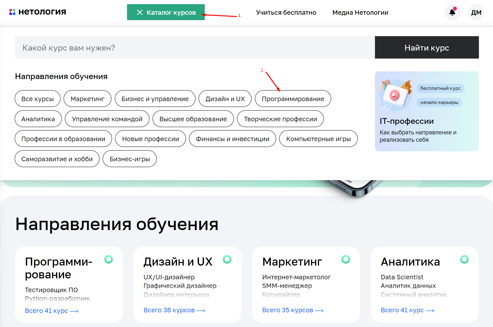
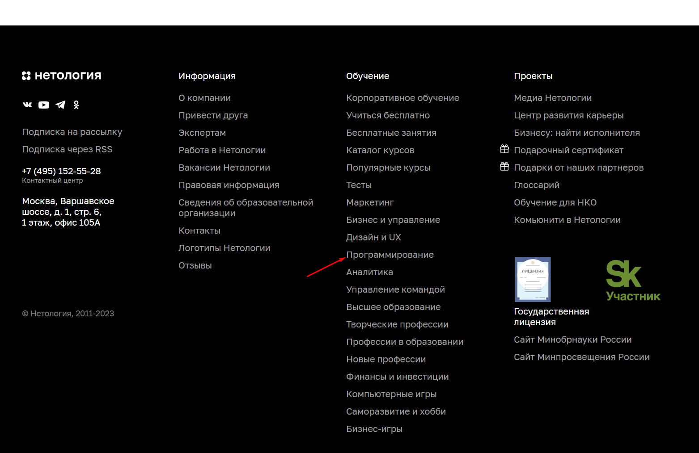
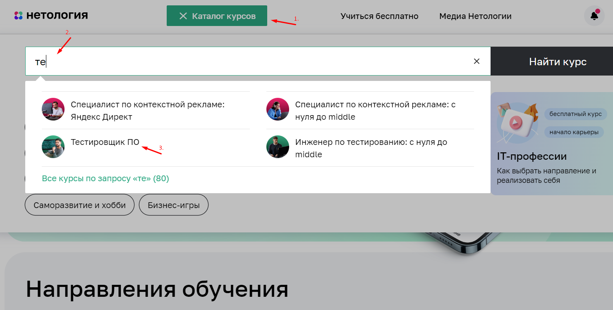
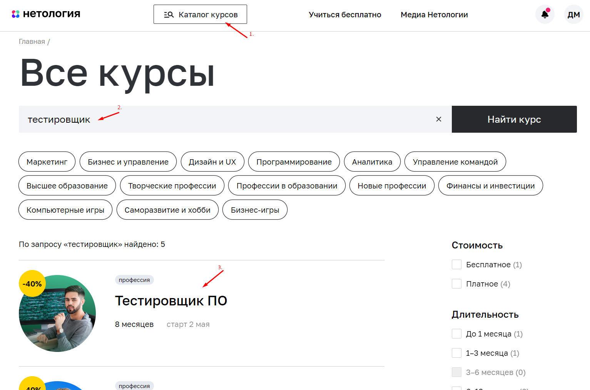
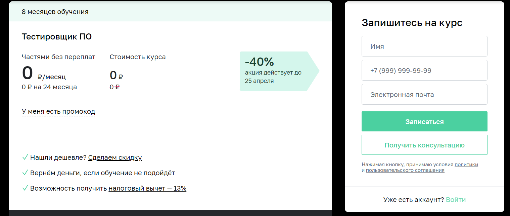
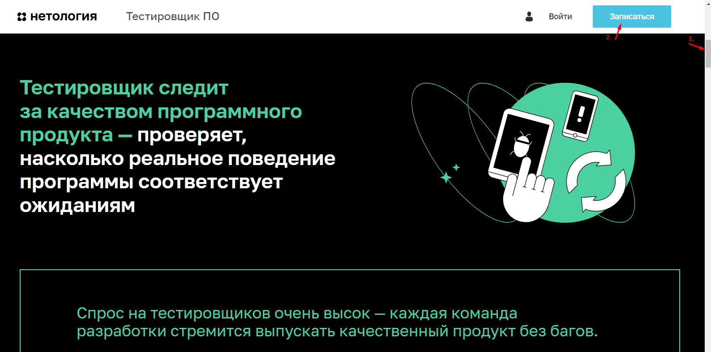

# План автоматизации тестирования записи на обучение профессии "Тестировщик ПО"
## Содержание:
* [**Перечень автоматизируемых сценариев**](#script)
* [**Перечень используемых инструментов**](#tool)
* [**Перечень необходимых разрешений, данных и доступов**](#permission)
* [**Перечень и описание возможных рисков при автоматизации**](#risk)
* [**Перечень необходимых специалистов для автоматизации**](#specialist)
* [**Интервальная оценка с учётом рисков в часах**](#estimation)

## Перечень автоматизируемых сценариев
### Сценарии перехода на страницу профессии "Тестировщик ПО":
#### 1-ый сценарий:
1. Перейти на веб-сайт [Нетологии](https://netology.ru/)
2. Нажать кнопку "Каталог курсов" вверху сайта
3. В выпадающем списке нажать кнопку "Программирование" 

  
Нажмите, чтобы открыть изображение

4. На открывшейся странице нажать на блок с профессией "Тестировщик ПО"

  
Нажмите, чтобы открыть изображение

#### 2-ой сценарий:
1. Перейти на веб-сайт [Нетологии](https://netology.ru/)
2. Нажать на блок "Программирование" в разделе "Направления обучения"

  
Нажмите, чтобы открыть изображение

3. На открывшейся странице нажать на блок с профессией "Тестировщик ПО"

#### 3-ий сценарий:
1. Перейти на веб-сайт [Нетологии](https://netology.ru/)
2. Промотать страницу до конца вниз
3. Нажать кнопку "Программирование" в столбце "Обучение"

  
Нажмите, чтобы открыть изображение

4. На открывшейся странице нажать на блок с профессией "Тестировщик ПО"

#### 4-ый сценарий:
1. Перейти на веб-сайт [Нетологии](https://netology.ru/)
2. Нажать кнопку "Каталог курсов" вверху сайта
3. Ввести "те" в появившейся поисковой строке
4. Нажать на блок "Тестировщик ПО" в выпадающем списке

  
Нажмите, чтобы открыть изображение

#### 5-ый сценарий:
1. Перейти на веб-сайт [Нетологии](https://netology.ru/)
2. Нажать кнопку "Каталог курсов" вверху сайта
3. Ввести "тестировщик" в появившейся поисковой строке
4. Нажать кнопку "Найти курс"
5. Нажать на блок с профессией "Тестировщик ПО" в появившемся списке профессий

  
Нажмите, чтобы открыть изображение

### Сценарии перехода к форме заявки на обучение профессии "Тестировщик ПО":
#### 1-ый сценарий:
Нажать кнопку "Записаться" на [странице профессии](https://netology.ru/programs/qa)

  
Нажмите, чтобы открыть изображение

  
Так выглядит форма

#### 2-ой сценарий:
Находясь на [странице профессии](https://netology.ru/programs/qa), промотать её вниз, до формы "Запишитесь на курс"

#### 3-ий сценарий:
1. Находясь на [странице профессии](https://netology.ru/programs/qa), промотать её немного вниз
2. Нажать кнопку "Записаться", которая находится в появившейся вверху сайта плашке

  
Нажмите, чтобы открыть изображение

### Сценарии заполнения формы заявки на обучение профессии "Тестировщик ПО":
#### 1. Валидные значения:
1. Ввести валидное значение в поле "Имя"
2. Ввести валидное значение в поле ввода номера телефона
3. Ввести валидное значение в поле "Электронная почта"
4. Нажать кнопку "Записаться" в форме "Запишитесь на курс"

*Ожидаемый результат:* Данные отправлены. Отображается сообщение об успешной записи.

#### 2. Невалидное имя:
1. Ввести невалидное значение в поле "Имя"
2. Ввести валидное значение в поле ввода номера телефона
3. Ввести валидное значение в поле "Электронная почта"
4. Нажать кнопку "Записаться" в форме "Запишитесь на курс"

*Ожидаемый результат:* Данные не отправлены. Под полем "Имя" сообщение красным цветом "Должно состоять из букв"

#### 3. Невалидный номер телефона:
1. Ввести валидное значение в поле "Имя"
2. Ввести невалидное значение в поле ввода номера телефона
3. Ввести валидное значение в поле "Электронная почта"
4. Нажать кнопку "Записаться" в форме "Запишитесь на курс"

*Ожидаемый результат:* Данные не отправлены. Под полем номера телефона сообщение красным цветом "Номер в формате +9 (999) 999-99-99"

#### 4. Невалидная электронная почта:
1. Ввести валидное значение в поле "Имя"
2. Ввести валидное значение в поле ввода номера телефона
3. Ввести невалидное значение в поле "Электронная почта"
4. Нажать кнопку "Записаться" в форме "Запишитесь на курс"

*Ожидаемый результат:* Данные не отправлены. Под полем "Электронная почта" сообщение красным цветом "Неверный email"

#### 5. Отправка пустой формы
1. Оставить поля незаполненными
2. Нажать кнопку "Записаться" в форме "Запишитесь на курс"
   
*Ожидаемый результат:* Данные не отправлены. Под полями ввода данных сообщение красным цветом "Обязательное поле"

## Перечень используемых инструментов
* **IntelliJ IDEA** - интегрированная среда разработки (IDE), которая обладает высокой производительностью и многими функциями, такими как поддержка отладки, автодополнение кода, интеграция с системами контроля версий и т.д. Это отличный выбор для разработки на Java.
* **Java** - объектно-ориентированный язык программирования, который широко используется для разработки приложений, веб-сервисов и мобильных приложений. Это очень популярный язык в среде тестирования, так как многие инструменты для автоматизации тестирования написаны на Java.
* **Gradle** - система автоматической сборки, которая позволяет разработчикам создавать проекты и управлять зависимостями между ними. Он является более гибким и производительным в сравнении с Maven, что делает его отличным выбором для тестирования.
* **JUnit** - библиотека для тестирования кода на Java. Он обеспечивает функциональность для написания и запуска тестовых сценариев, что делает его одним из самых популярных инструментов для тестирования на Java.
* **Java Faker** - библиотека для генерации фиктивных данных на Java. Это может быть очень полезно при написании тестовых сценариев, когда необходимо заполнить формы или поля данными.
* **Selenide** - фреймворк для автоматизированного тестирования веб-приложений на Java. Он предоставляет более простой и интуитивно понятный API для написания тестовых сценариев, чем Selenium WebDriver.
* **Git** - система контроля версий, которая позволяет разработчикам отслеживать изменения в коде и сотрудничать друг с другом при разработке проекта. Это очень полезный инструмент в среде тестирования, где часто требуется совместная работа.
* **Report Portal** - инструмент для управления отчетами о тестировании. Он предоставляет возможность создавать дашборды, отслеживать результаты тестирования и анализировать данные. Report Portal облегчает управление результатами тестирования и обеспечивает прозрачность и своевременную отчетность.
* Также возможно потребуется **Docker** - открытая платформа для разработки, доставки и эксплуатации приложений. Он позволяет разработчикам создавать приложения в контейнерах, которые могут быть легко перенесены между различными средами.
  
## Перечень необходимых разрешений, данных и доступов
* Разрешение на проведение тестирования от владельца сайта или соответствующего подразделения компании для проведения тестирования
* Доступ к базе данных
  
## Перечень и описание возможных рисков при автоматизации
* Необходимость корректировки тестов при изменении кода, связанного с формой записи
  
## Перечень необходимых специалистов для автоматизации
* Инженер по автоматизации тестирования или "fullstack" тестировщик ПО
  
## Интервальная оценка с учётом рисков в часах
* Подготовка используемых инструментов: ~8 часов
* Написание автотестов и тестирование: ~24 часа
* Формирование отчетов: ~3 часа
